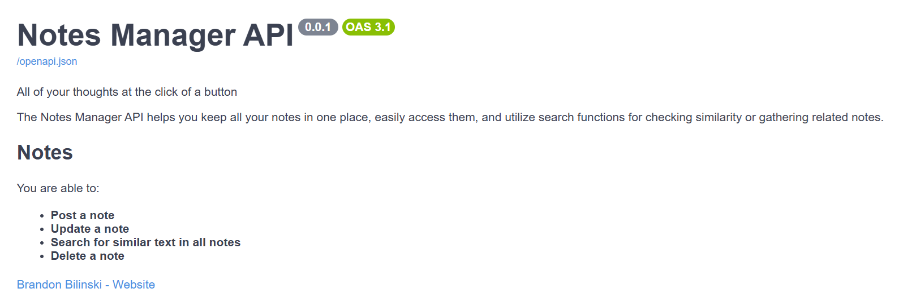
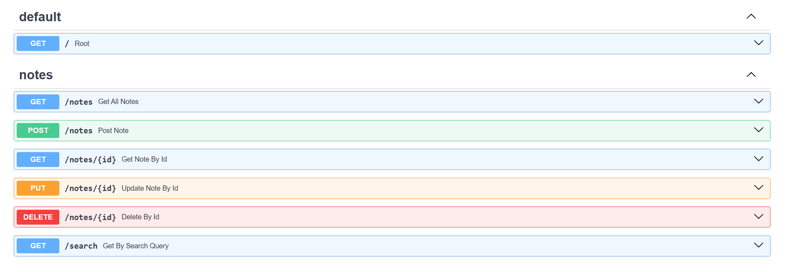

# Notes Manager API - Brandon Bilinski
A Personal Project exploring API creation, PostegreSQL Internals, and Semantic embeddings.

## Project Function
This project was created to strengthen and familiarize myself with industry standard development tools. It serves as an entrypoint into a database using asynchronous methods, FastAPI, and alembic migrations. It has been dockerized as well to include the necessary Postgres extensions for semantic embedding.

## Getting Started
### Prerequisites 
- Make
- Docker Desktop
- Python 3.9+
- pip

### Makefile
The system can be set up by simply running the makefile. To do this, navigate to the root directory of the project that contains the makefile and run
``` 
make run
```

This will install the necessary docker images, python packages, start the database, and initalize the api service.

### Manual Start Up
To start up manually, run 
```
docker-compose up
```
in the folder that contains the docker-compose.yml file.

This will download the necessary images and start the database.

You can check to make sure the container is running in docker desktop.

Download all required packages
```
pip install -r requirements.txt
```

Run the alembic migrations with 
```
alembic upgrade head
```

To run the api in dev mode, activate the virtual environment and run 
```
fastapi dev .\app\main.py
```

From there you should be able to interact with the api service and see its documentation.

## Available API Functions 




##### Created By Brandon Bilinski (https://github.com/brandonbilinski)
